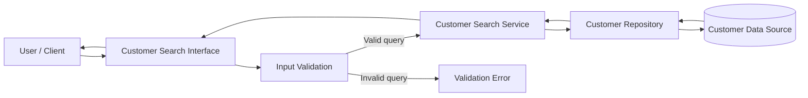

# Architecture

## Overview

The Customer Search feature follows a simple layered architecture that separates input handling, validation, search logic, and data access.

The architecture is designed to keep the search behavior easy to test and maintain while avoiding unnecessary coupling to a specific framework, database, or user interface.

The feature introduces a search flow without modifying the existing Customer domain model.



## Components

### Customer Search Interface

Receives the search query from the user or calling client and exposes the Customer Search functionality.

The concrete interface may be an API endpoint, controller, command, or other entry point depending on the existing application architecture.

### Input Validator

Validates the search query before the search operation is executed.

It identifies invalid input such as:

- Empty strings.
- Strings containing only whitespace.

Rules related to trimming whitespace and minimum query length remain dependent on the unresolved questions defined in REQUIREMENTS.md and SPEC.md.

### Customer Search Service

Contains the application logic required to perform Customer Search.

It coordinates validation and customer retrieval while remaining independent from the concrete persistence mechanism.

### Customer Repository

Provides access to existing customer records.

It is responsible for retrieving customers whose name or email matches the search query according to the search rules defined in SPEC.md.

### Customer Data Source

Represents the application's existing customer persistence mechanism.

This may be a database, in-memory collection, external persistence service, or another existing data source.

The Customer Search feature does not require a specific persistence technology.

## Responsibilities

| Component | Responsibility |
|---|---|
| Customer Search Interface | Receive the query and return the search result or validation response |
| Input Validator | Determine whether the query is valid before searching |
| Customer Search Service | Coordinate the Customer Search operation |
| Customer Repository | Retrieve matching customer records |
| Customer Data Source | Store and provide access to existing customer data |

Responsibilities should remain separated so that validation, search behavior, and persistence can be tested independently.

## Data Flow

The Customer Search request follows this sequence:

1. The user or client submits a search query.
2. The Customer Search Interface receives the query.
3. The query is validated.
4. If validation fails, the operation stops and a validation response is returned.
5. If validation succeeds, the Customer Search Service requests matching customers from the Customer Repository.
6. The Customer Repository searches the existing customer data using the name and email fields.
7. Matching is performed according to the rules defined in SPEC.md, including partial and case-insensitive matching.
8. The repository returns the matching customer records.
9. The Customer Search Service returns the results to the interface.
10. The interface returns the result to the user or calling client.

A valid search with no matches returns an empty collection.

No step in this flow creates, updates, or deletes customer records.

## Interfaces

The architecture requires the following conceptual interfaces.

### Customer Search

**Input:**

- Search query: string

**Output:**

- Collection of matching customers, or
- Validation error for invalid input

Conceptually:

```text
searchCustomers(query) -> Customer[]
```

The exact function signature depends on the language and architecture of the existing project.

### Customer Repository

The repository must provide an operation capable of retrieving customers by a search query.

Conceptually:

```text
findByNameOrEmail(query) -> Customer[]
```

The operation must support the search behavior defined in SPEC.md.

No specific database query syntax or persistence implementation is required by this architecture.

## Error Handling

Invalid input must be detected before accessing customer data.

For invalid input:

```text
Request
   |
   v
Validation
   |
   +---- Invalid ----> Validation Error
   |
   +---- Valid ------> Customer Search
```

A valid query with zero matches is considered a successful search and returns an empty collection.

Unexpected persistence or infrastructure failures should use the application's existing error-handling mechanism rather than introducing a Customer Search-specific mechanism.

Search failures must not modify existing customer records.

## Testing Strategy

Testing is divided according to architectural responsibilities.

**Unit tests** should verify:

- Empty query validation.
- Whitespace-only query validation.
- Search by name.
- Search by email.
- Partial matching.
- Case-insensitive matching.
- Multiple matching customers.
- No matching customers.
- Prevention of duplicate results when both fields match.

**Integration tests** should verify:

- Communication between the Customer Search Service and Customer Repository.
- Retrieval of matching customers from the actual or test persistence layer.
- Correct empty result behavior.

Tests should also verify that Customer Search does not modify existing customer records and that repeated searches against unchanged data produce the same matching customer records.

The automated test suite must cover the scenarios defined in SPEC.md.

## Dependencies

Customer Search should reuse the application's existing:

- Customer domain model.
- Customer persistence mechanism.
- Repository or data-access infrastructure, when available.
- Validation and error-handling conventions, when available.
- Testing framework.

No new external dependency is required by the feature unless the existing application architecture makes one necessary.

## Design Decisions

### DD-01 — Separate validation from search execution

Input is validated before accessing customer data.

This prevents unnecessary data operations for invalid queries and makes validation behavior independently testable.

### DD-02 — Reuse the existing Customer model

Customer Search operates on the existing Customer domain model instead of introducing a separate search-specific customer model.

This avoids unnecessary duplication.

### DD-03 — Repository abstraction for data access

Search logic accesses customer data through a repository abstraction rather than depending directly on a specific database technology.

This improves testability and reduces coupling between application logic and persistence.

### DD-04 — Read-only search operation

Customer Search is architected as a read-only operation.

No component in the search flow is responsible for creating, updating, or deleting customers.

### DD-05 — Technology-independent search behavior

The architecture does not prescribe SQL `LIKE`, regular expressions, full-text search, or any other specific matching implementation.

The persistence implementation may choose the appropriate mechanism as long as the observable behavior satisfies SPEC.md.

### DD-06 — Existing application conventions take precedence

Where the existing application already defines controllers, repositories, error types, dependency injection, or testing conventions, Customer Search should integrate with those conventions rather than introducing a parallel architecture.

## Trade-offs

Separating the interface, validation, service, and repository introduces more structure than implementing the entire search operation in a single function. However, this separation improves testability, maintainability, and responsibility boundaries.

Using partial, case-insensitive matching provides a more useful search experience but may become more expensive as the number of customer records grows. The current architecture prioritizes correctness and simplicity without introducing premature optimization.

Using a repository abstraction adds an additional layer, but prevents the Customer Search Service from becoming coupled to a specific persistence technology.

The architecture intentionally avoids introducing advanced search technologies such as full-text search or dedicated search engines. These could improve performance for large datasets but would add complexity and dependencies that are not required by the current feature.